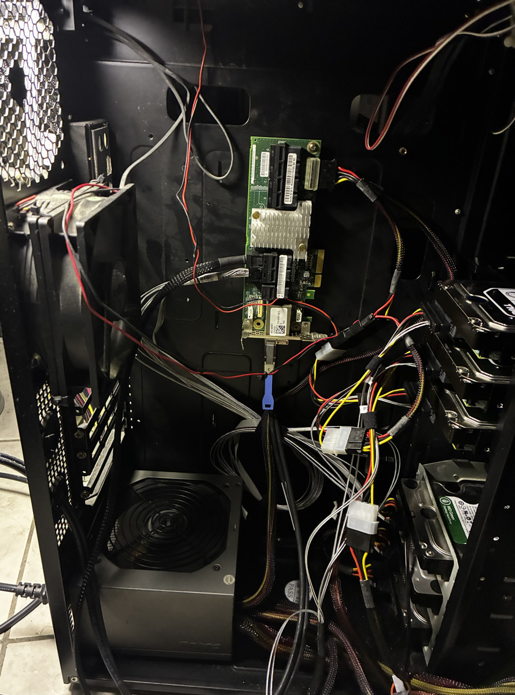
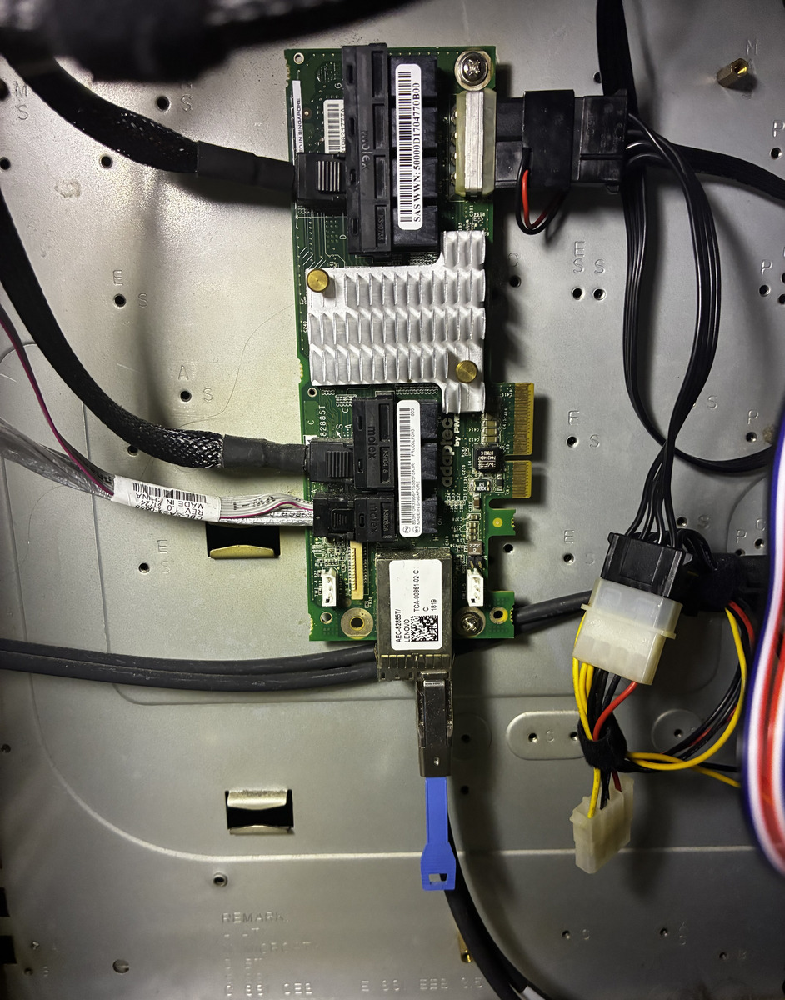

# todo

## goal
sometimes you outgrow your case, sometimes you want to shut down a 10 dvd drive tower when it's not in use. let's see where we can get.

## initial setup
- working config from the 
- old tower case (antec 1200 or thermaltake armor)
- sas expander ()
- external sas cable (sff-8644 <-> sff-8644)
- power supply
- 

## pics

