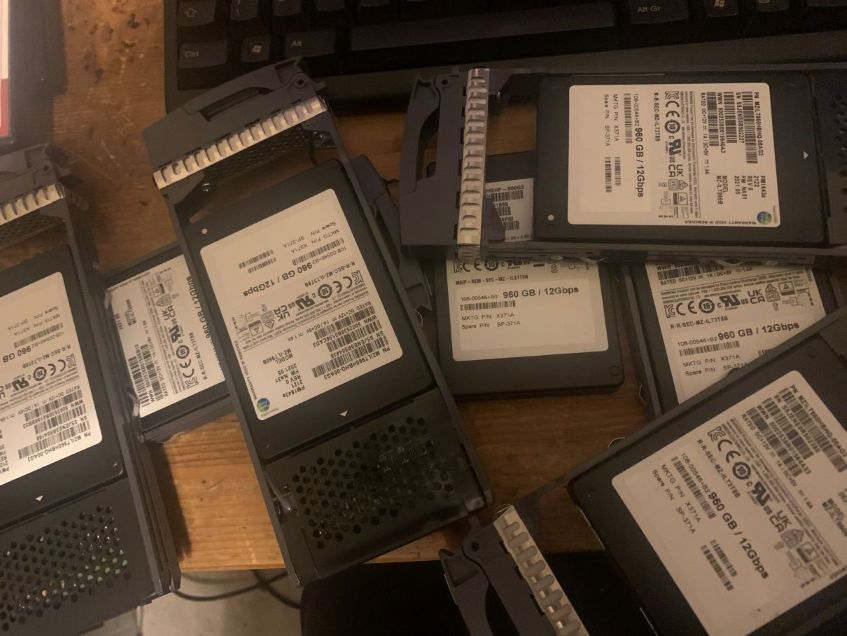

> [!INFO]
> atm this page has the most useful info, more is coming

# goal

reuse enterprise drives in home pc.

## initial setup
* windows 11 24h2
* asrock  , uefi 3.30
* amd ryzen 7 8700g
* wd black sn850x 8tb - no heatsink version
  * slot m2_1
  * slot m2_4
  * using heatsinks included with motherboard
* decent 800w psu

## hardware to add
* netapp x371 disk

## steps

{}
1. ### find a device you want to connect.
    in general this should be a sata or sas device. sata express and pcie devices can already be excluded.

1. ### figure out what connection is needed
    have a look at the type of connector your device has to figure out the exact type. 

1. ### select hba
    > [!IMPORTANT]
    > this will be the most important choice you'll make
    #### vendor
    there are only 3 valid players left on the market: broadcom, microchip & atto.
    ##### broadcom
    * by far the dominant player
    * their older products can are sold under the "lsi" or "avago" brand name
    * almost all hba's and raid controller from vendors like hp, dell, ibm, lenovo, etc... are actually broadcom devices. 
    ##### microchip
    * also known as microsemi, adaptec & pmc-sierra
    * no current oem cards that i know of
    * market share tiny compared to broadcom but they're trying to make a comeback
    ##### atto
    * no experience with their hba's
    #### controller mode
    * you want a "hba" controller, also known as "it mode" for older controllers.
    * you do not want a raid controller, even if it's running in jbod mode.
    * you do not want a "sas expander"
    #### the fine print
    there might be some non obvious limitations for certain devices. they are mentioned in the manuals, which i recommend reading. at this stage in your journey they might not stand out, so here is the  i've found.
    #### some controllers i have used
    * 
    * 
    * 
    * 
    > [!IMPORTANT]
    > current advise: broadcom 9500 series
    * non-oem (so actual broadcom) highly suggested over oem versions
    * 2 connectors recommended (so 9500-16i, or 9500-8e/16e)
    * cheaper alternative: lsi 9300-8i or 9300-4i4e
    #### selection criteria
    * current needs and possible future needs
    * price
    * eol/eos timeframe
    * amount and type of connectors
    * power/heat

1. ### get cables (todo)
    * sff-8087/8088
    * sff-8643/8644
    * sff-8482
    * sata

1. ### software needed
   you will need a few tools to get everything set up. they're freely available, these 2 are the most important.
   #### 
   storcli is the software you'll need to interface with broadcom cards (hba and raid)
   #### 
   sg3 utils is an expansive collection of tools that covers almost every aspect of the sas features.
1. ### install hba, drivers-firmware-airflow
    * 
    * airflow
    * 
    * drivers

1. ### connect device

1. ### initialize, update fw, reformat

1. ### profit

{}
