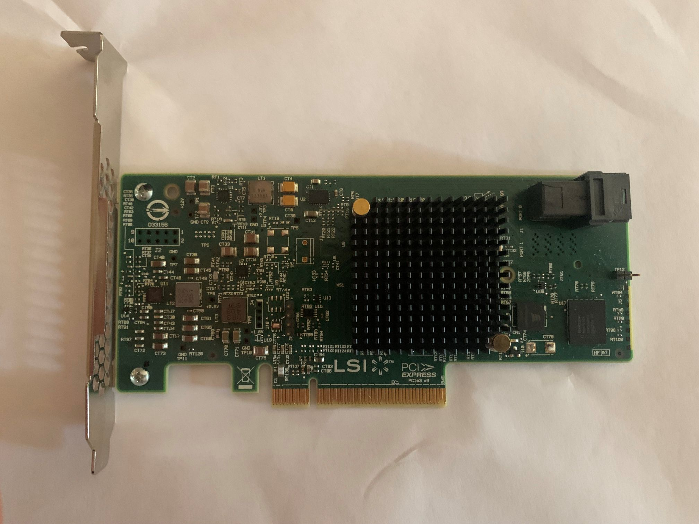
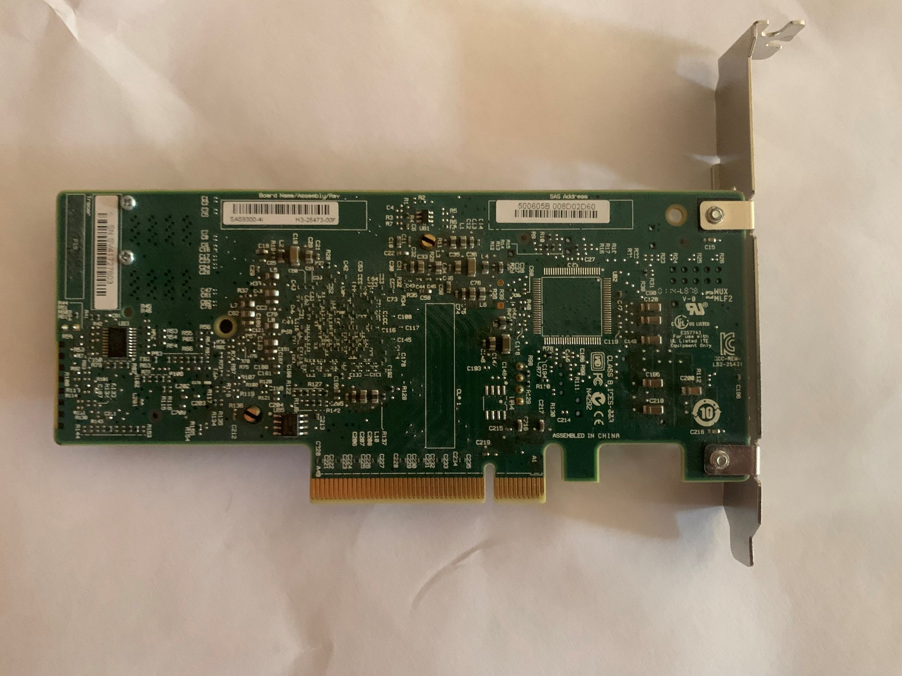

# lsi 9300-4i
lsi / broadcom branded internal sas hba with 1 sff-8643 connector

## verdict
it's lsi branded, sas-3 and cheap second hand, versus, 1 connector is
limiting, power usage is high for just 1 connector, docs aren't great.

it being end of support is of course the biggest issue. end of support means
no more firmware and driver updates no matter what. broadcom does not have
windows 11 drivers for the card.

todo recheck: i got mine via windows update on 23h2,

### used

## general specs
- chipset: sas3004
- host interface: pcie3 x8
- connectors: 1 sff-8644
- sas 12, 6 & 3gb/s
- sata 6 & 3gb/s

## power and cooling
- 10.2watt power usage
- airflow 200lfm

## opinion

- pro
  - hba
  - lsi branded
  - win11 23h2 drivers via windows update
    - todo recheck
  - does not get burning hot
  - sas3 support
  - vented bracket
- con
  - end of support
  - no broadcom windows 11 drivers
  - only 1 connector
  - gets warm

## images

