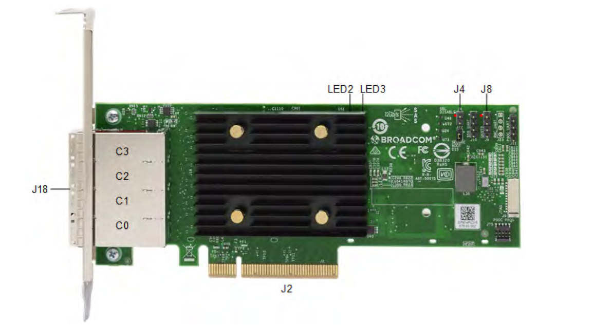
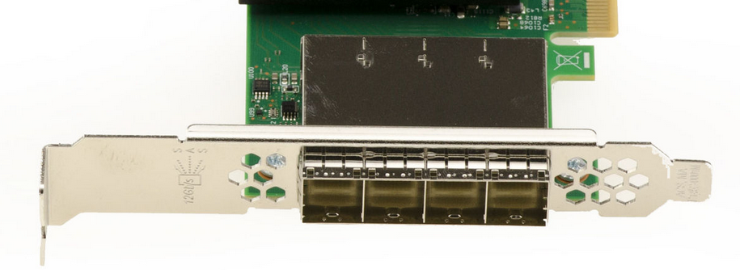

# broadcom 9500-16e

broadcom branded sas hba with 4 sff-8644 connectors

## general specs
* sas 12, 6 & 3gb/s
* sata 6 & 3gb/s
* 8.5w power usage
* airflow 150lfm
* 55°c preferred tempature, storcli says it can do up to 115°c

## opinion

* pro
  * hba
  * 4 connectors
  * active support
  * windows11 24h2 support
  * pcie4
  * power efficient (compared to alternatives)
  * half & full size bracket included
* con
  * not cheap
  * no built in internal connectors
  * no nvme support (perhaps a pro, nvme on 9500 series isn't great)
  * to many steps to update onboard code (psoc, bios, uefi, those things)
  * external connectors leave little room for airflow through the bracket

## images

