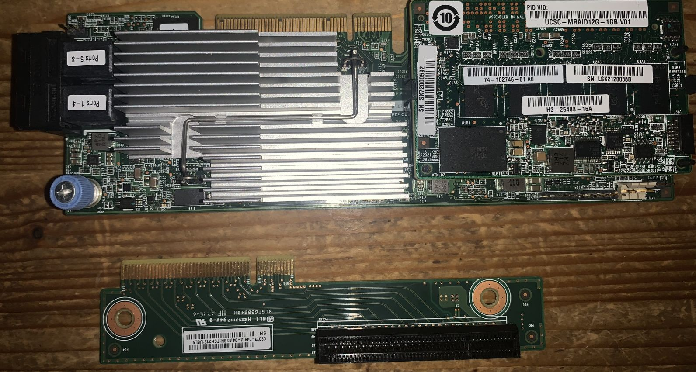
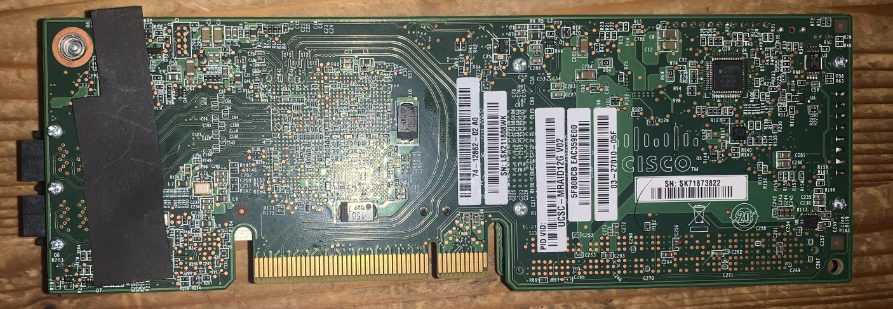

# cisco ucsc mraid12g
cisco ucsc mraid12g with 1gb cache

## verdict
the pcb is custom built for cisco c-series. in a regular pc thisw ill make
it stick out the back of your pc where the bracket should normally be. this
is asking for trouble. did try it, when i turned my box of after 5 minutes to
reposition the card actually burned my fingers.

did not try again.

todo recheck this

included pcie riser

## general specs
- connectors: 2 sff-8643

## opinion
- pro
  - saved from eol server, so free
  - nvme backup
  - connectors can be bundled
  - included pci riser allows for less wonky install
- con
  - gets --stupid-- hot
  - raid card, not hba. didn't try to reflash to hba mode.
  - did not come with any bracket
  - is oriented the wrong way for normal pc install (will stick out where bracket should be)
  - did i mention how hot it gets?
  - heavy, will put strain on the pcie slot

## images
### top with included pcie riser

### bottom

