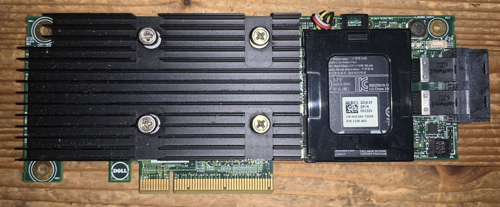

# dell perc h730

dell perc h730 with 1gb battery (i think)

## general specs
* lsi sas3108 (megaraid 9300 series - likely 9361-8i)
* sas 12, 6 & 3gb/s
* sata 6 & 3gb/s

## opinion

* pro
  * saved from eol server, so free
  * battery pack
  * 2* sff*8643
* con
  * pcie 3
  * gets very hot quickly
  * raid card, not hba. didn't try to reflash to hba mode.
  * did not come with full sized bracket
  * actual battery, no non volatile memory

## images

