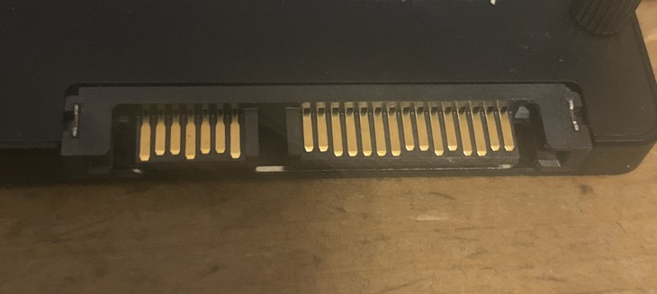
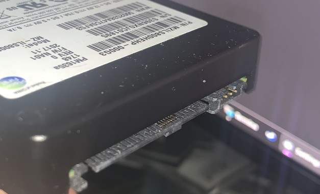
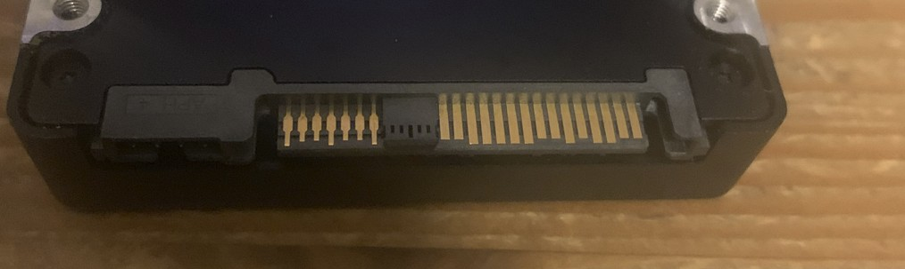
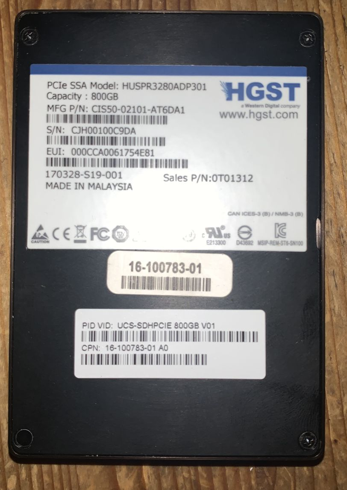
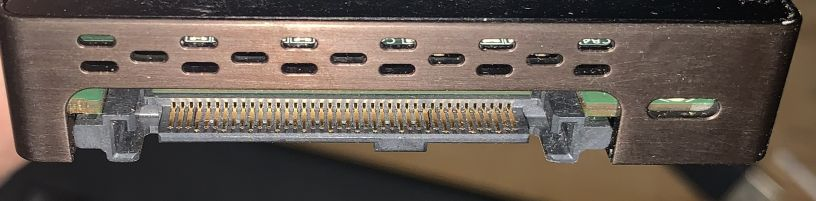
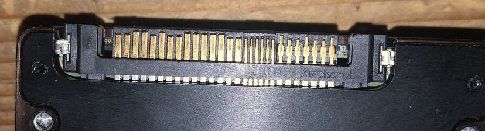

# common drive interface types
and how to identify them

## connector keying

keying refers to the physical layout of the connectors so it's not physically possible to plug in the wrong type of cable.

### sata

### sata express

### sas

### enterprise pcie

## close ups

### sata

power and data plug are seperate connectors with a split between the two.

### sas

#### sff-8482 (sff-8680) - eia-966 (aka: sas connector)
* sff-8482: serial attachment 2x unshielded connector
* sff-8680: serial attachment 12gb/s 2x unshielded connector 

your basic sas disk connector. both power and data are in a single connector with a notch where the split is between sata connectors. this will prevent you from using sata power and/or data on sas disks. the top side of the notch also has extra pins.

top:

bottom:

#### sff-8630 (aka: sas multilink, aka: sas x4)
* sff-8630: serial attachment 12gb/s 4x unshielded connector

like sff-8482 but with more pins to support multilink, should compatible i think.

### enterprise pcie

#### u.2 nvme - sff-8639
* sff-8639: multifunctional 12gb/s 6x unshielded connector

looks like sff-8482 but with even more pins to support pci-e.

top:

bottom:

### u.3 - sff-ta-1001
