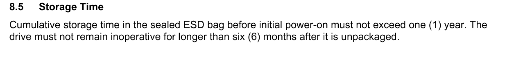
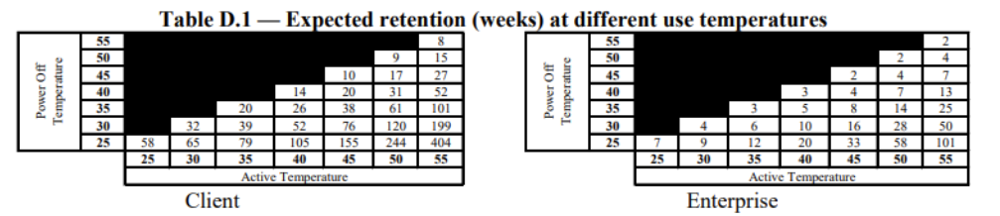
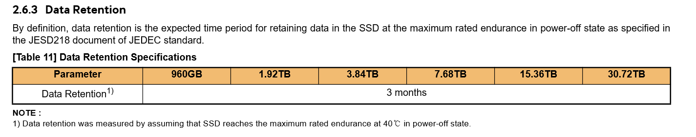
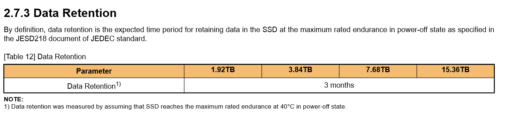

# how long will a powered of ssd retain it's data?
only that question. write endurance, fw failure, etc are out of scope.
how to backup your data will not be covered here either.

## beware those who claim to have the answer
how important is your data? is one aricle or forum post enough to convince you?

## personal
do you trust this post? i don't tend to get disks to not use them, these are the ones that i have as sample size.

anecdotal:
* samsung 840 pro had been powered of for 8 years without any data loss
* 3 pm1643 drives for 4 months without data loss
* 20 intel ssd dc s3510, no dataloss after powered off just over a year

the samsung was a surprise, did not expect it would be intact. the others were at or just over the time i would start worrying. that's taking into account the conditions they operated in, how they were stored & the nand technology used. do _not_ take this as set in stone.

## jedec
jedec's jesd218c & jesd219 go into more detail on "retention use", which boils down too:
* when active, run your drives hot
* when powered off, store your drives cool

the requirements set forth are:
* client ssd: 1 year data retention when stored at room temperature
* enterprise ssd: 3 months of data retention above room temperature.

the bigger the delta between hot/active & cold/powered off: the longer it takes before the loss occurs.

jeds218's primary purpose is to provide a standardized testing procedure, is stresses that there are many factors that determine data retention - no single nor set of tests can all use cases the remark goes.

### nand cell type
a personal addendum: while drives are powered on the background patrol will refresh a cell's voltage when it goes outside a certain margin.

#### slc
with slc the concept is simple: reads above a certain voltage level are true (1), reads below are false(0)

#### dlc
with dlc you store 2 bits per cell, so you need (2^2=4) voltage levels to represent all possible values. possible voltage drops will have a more pronounced & negative impact. while powered on the disk's background partrol will handle this, powered off it will retain data less long.

#### tlc
with tlc were are storing 3 bits perl, so we're now at (2^3=8) voltage levels to represent all possible values, and like dlc the error margin will become even smaller, again leading to a reduction in data retention.

## publications by vendors
here are some extracts from data sheets, where enterprise class disks often mention the data retention period. for consumer class disks it's seldom mentioned.

### hitachi ultrastar sn100
2017 datasheet:

### unnamed storage appliance vendor
2024 advisory:

### unnamed ssd vendor
2018 datasheet:

2023 sheet:

## conclusion
while i have yet to experience data loss due to a disk being powered off over too long a period, it's important to take note of what the vendors publish. having to mention a data retention period it's exactly good optics, neither is publishing an advisory on data loss when you're a storage company.

i keep my ssd's powered when possible.
