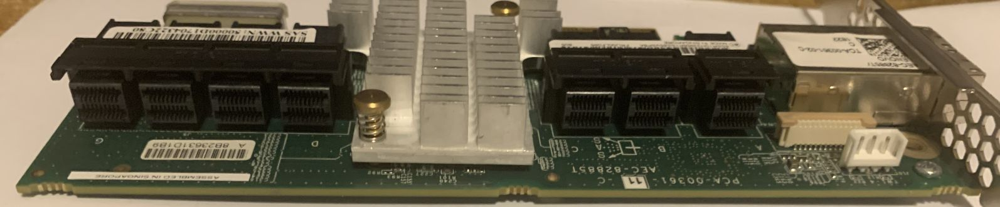
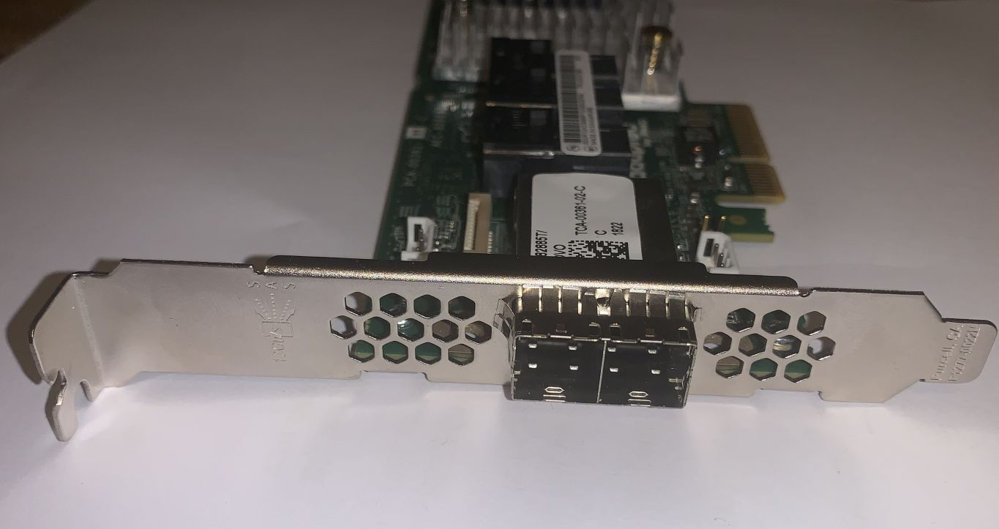
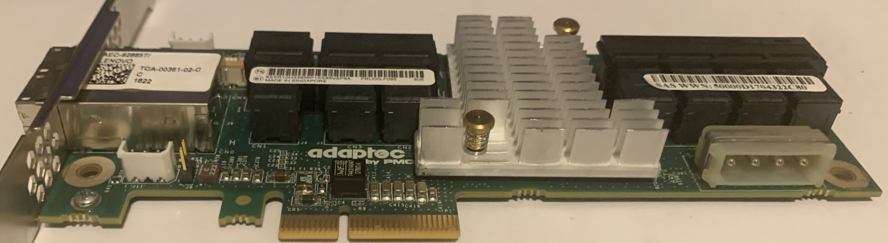
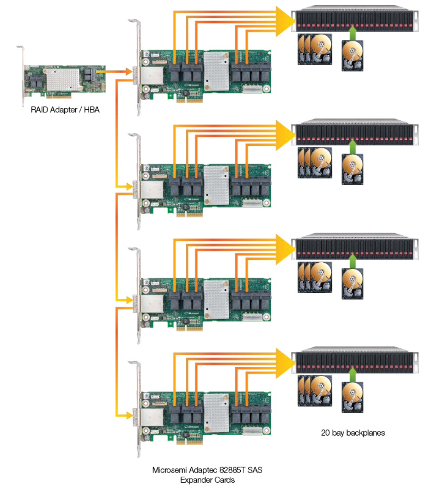
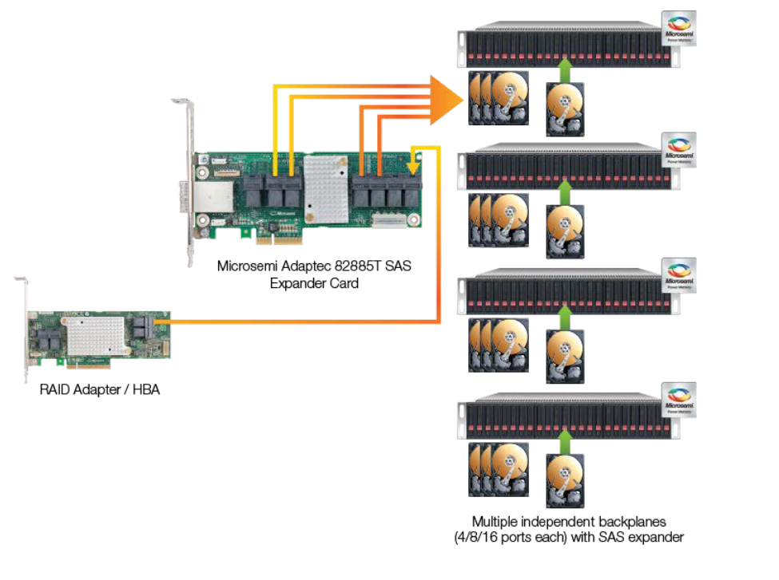
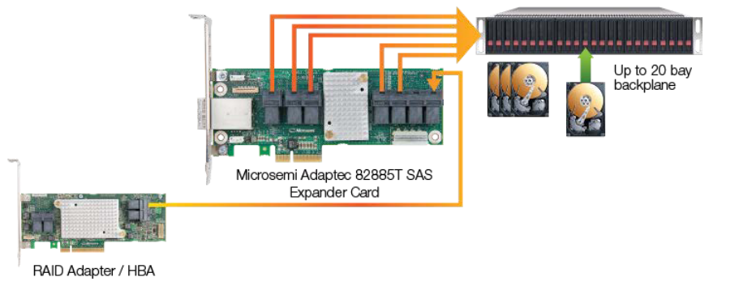
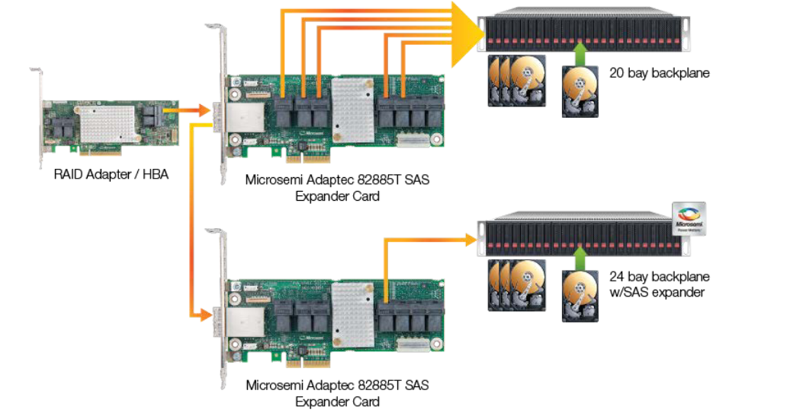

# adaptec aec-82885t sas expander
nifty little thing. the lenovo and white label versions make up most of the versions
you can buy. the adaptec proper and intel ones are likely knock-offs.

## part numbers

- adaptec/microchip order code: `2283400-r`
- adaptec/microchip name: `aec-82885t card`
- lenovo part number: `fru00lf095`
- intel's name: `intel raid res3fv288`
- white label: 

> [!WARNING]
> unless you can get actual pictures it will be very hard to tell which version you'll get
> some vendors reuse the same images, some have no idea what they sell, some are lying.

the trend seems to be that the intel and adaptec version go for a big premium (up to 10-15times more).
all cards i have lenovo stickers. the specdocs did not point out any glaring differences. my untrained eye
did not find anything obvious in the firmwares either.

as such i have no reason to assume that any of the versions are better or worse, nor do i see a reason to
overpay for a specific vendor.

todo: did adaptec license their core, are there fakes, am i paranoid?

## buyer's guide

how to identify a card, the details that are missed and not get tricked
into overpaying: .

todo: a word on pci subsys id's and verify all my cards.

## firmware
- adaptec: 0.59
- intel: 0.57 (also includes cpld 2.1.0)
- lenovo: 0.63

it's not clear to me what the difference might be between these versions. i hope to get some insight should i be able to track down an adaptec or intel card.

updating the firmware on these adapters is explained in more detail .

todo: is firmware portable over subsys id's?

## general specs
- chipset: pm8044 sxp 36sx12g
- host interface: none
- connectors:
  - 6 sff-8643 which can connect to drives
  - 1 sff-8643 to connect to controller or expander
  - 2 sff-8644 to connect to controller or expander
- sas 12, 6 & 3gb/s
- sata 6, 3 & 1.5gb/s
- cascading expander support
- stp

## power and cooling
- 16watt (1.34a @ 12v)
- 200lfm airflow

## connectors
> [!IMPORTANT]
> 6 connectors can have direct attached devices (for a total of 24) devices
- the external connectors (sff-8644) cannot be used to attach drives, only expanders or controllers
- the leftmost internal connector (sff-8643) cannot be used to attach drives, only expanders & controllers
- the internal connector next to the leftmost can be used to attach drives but not on very old firmwares
- the 5 remaining internal connectors can be used to attach drives

## software
expanders do not need software or drivers to work, actual plug & play.

## opinion
- pro
  - can be powered via either pcie or the molex connector
    - can transform a case with psu into a drive chassis
  - makes sata 1.5gbps work with newer hbas
  - comes with vented full and half size bracket
  - supports wide ports on external and internal connectors
  - can be daisy chained
  - todo picture of card mounted on atx standoffs
- con
  - todo lenovo health alert (cosmetic most likely)
  - needs some decent airflow to cool
  - needs adaptec controller to use cli config tool
    - i do doubt this since lenovo bundles this with a broadcom hba while seemingly supporting cli config
    - updating firmware & some other basic things do work through storcli
  - documentation could be better
  - ~~eol & eos, even though lenovo released a firmware update in 2025~~ todo: is it?
    - eol/eos intel, in production microchip
  - most sellers seem to either don't know which version they're selling or trying to rip you off

## images
### 7 sff-8643

### 2 sff-8644

### 1 molex power plug

## example topologies
### fanout / daisy chain

### stacked disk shelves with build-in expanders

### make everything jbod

### mixed jbod and expander

