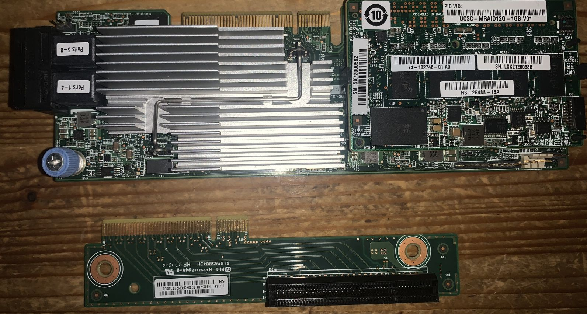
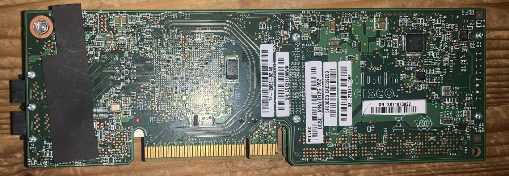

# cisco ucsc mraid12g

cisco ucsc mraid12g with 1gb cache

## general specs

## opinion

* pro
  * saved from eol server, so free
  * nvme backup
  * 2* sff*8643
* con
  * gets **stupid** hot
  * raid card, not hba. didn't try to reflash to hba mode.
  * did not come with any bracket
  * is oriented the wrong way for normal pc install
  * did i mention how hot it gets?

## images

