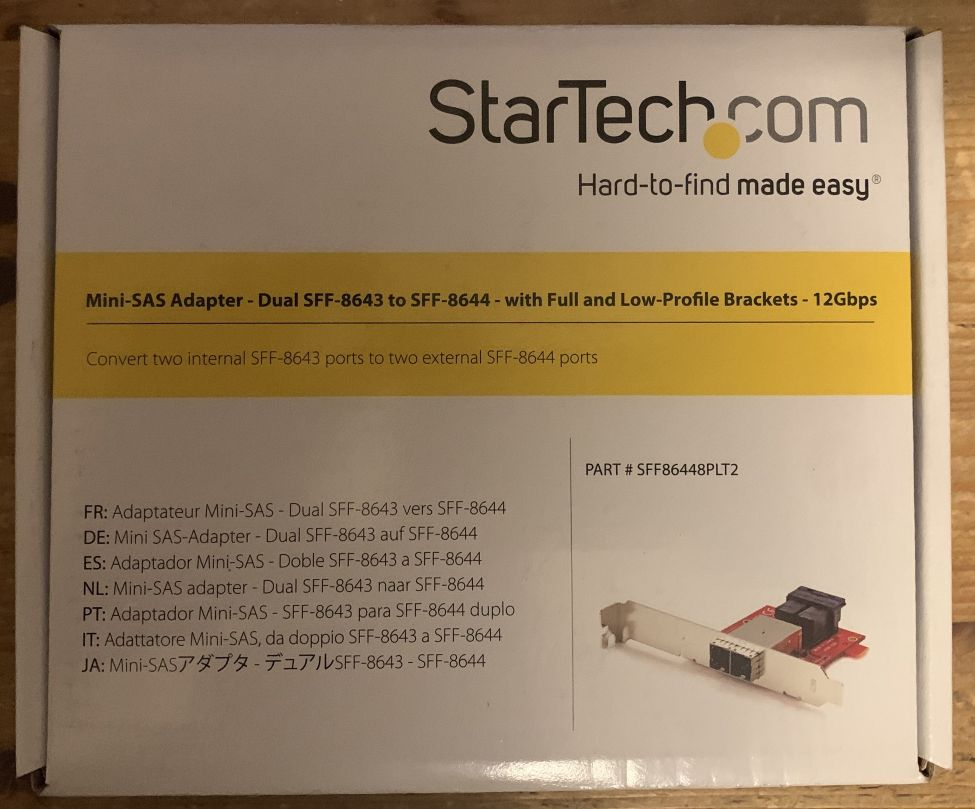
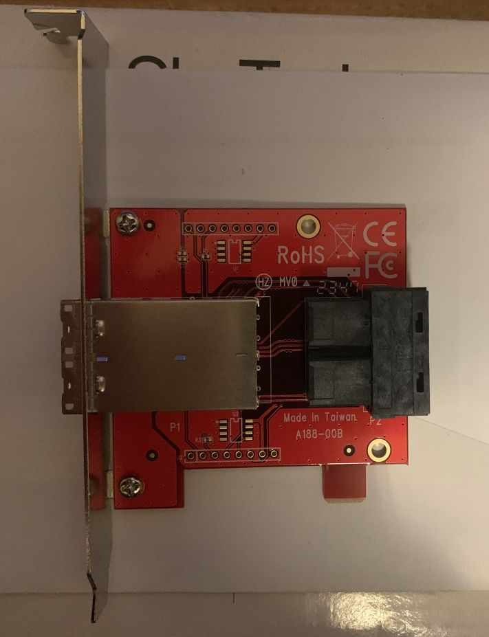
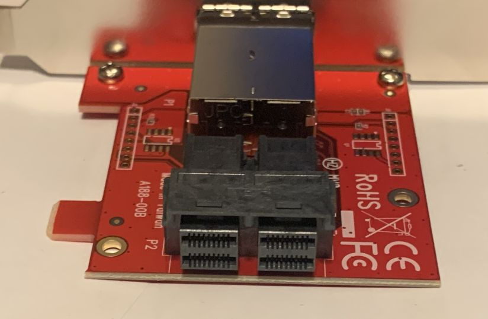
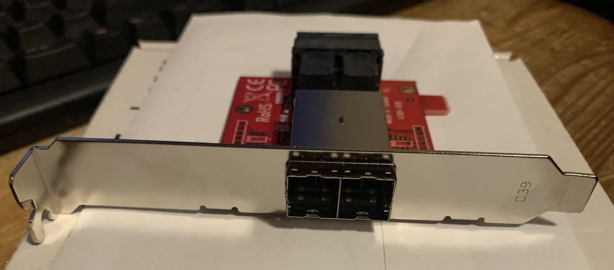

# sff-8644 to sff-8643 converter
passive converter by startech

## product id
sff86448plt2

## general specs
- passive (no power nor cooling needed)
- 2 sff-8644 connectors
- 2 sff-8643 connectors
- full size & half size bracket included
- no vented brackets
- bracket could be a tighter fit

## reason
an inexpensive option to interchange internal and external ports 

## images

### box

### card - top view

### detail internal ports

### detail external ports

