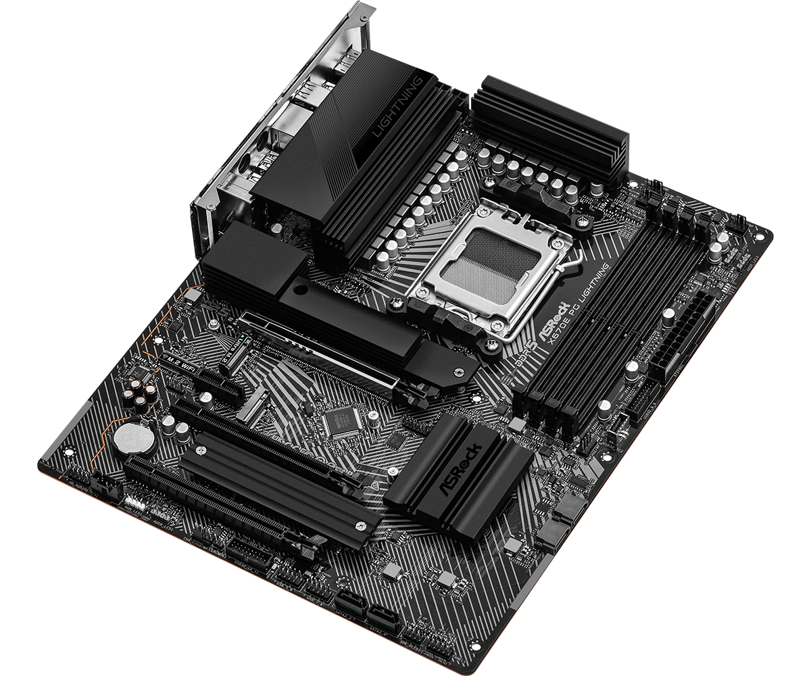

# asrock x670e pg lightning
asrock am5 motherboard using the amd x670e chipset for amd ryzen 7000, 8000 & 9000 series cpus.

## which slot for the hba
pcie slot 3 is the optimal place for your hba if you plan on using pcie slot 1.

## reasons
- pcie lanes directly from cpu
- pcie 4.0
- physical x16 slot, 4 data lanes
- clearance under the slot for airflow
  - [included heatsink](#photo-side-view) for slot m2_4 is low profile

## images
### diagram

### bandwidth routing

### cpu support vs pcie support

### expansion slot outtake

### photo: top view

### photo: side view

