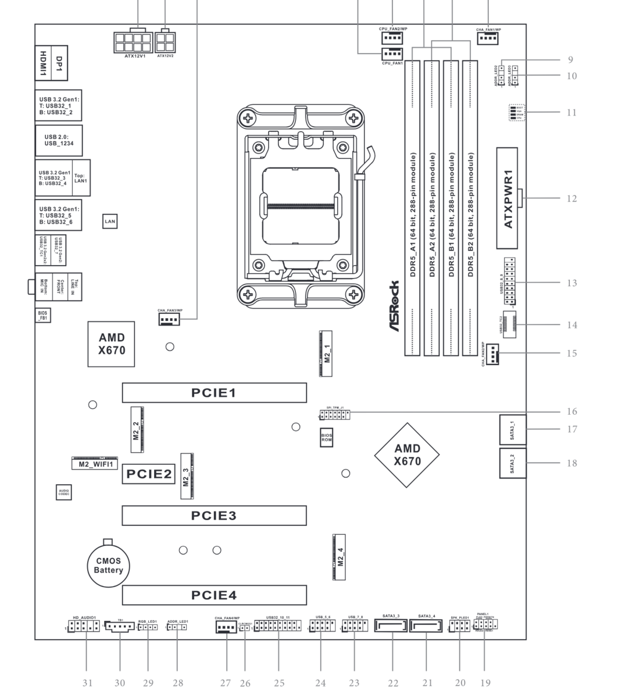
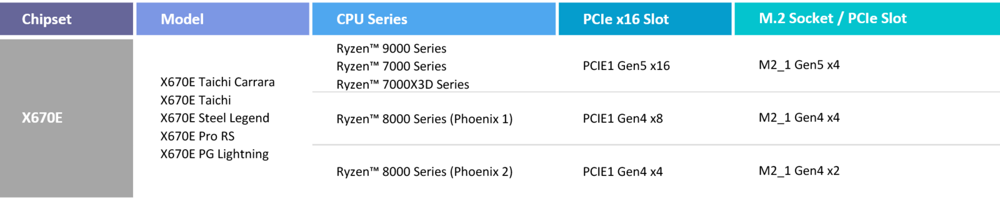
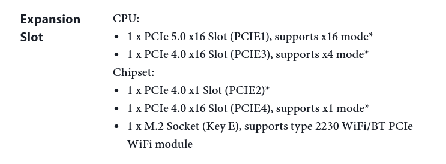
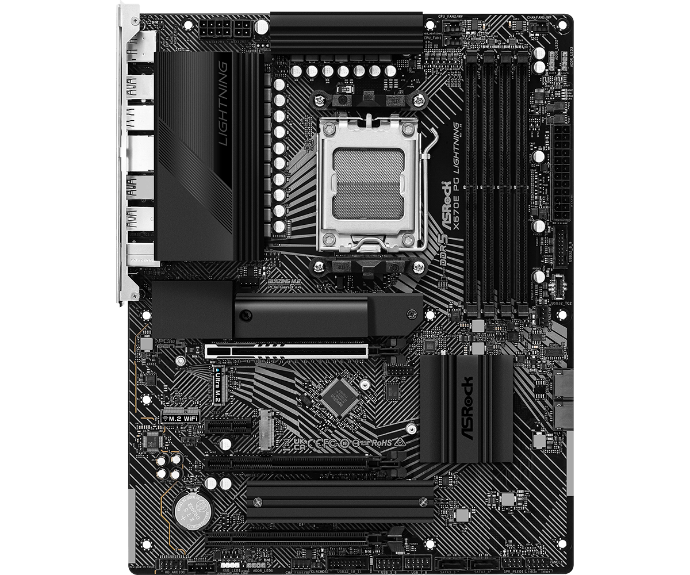
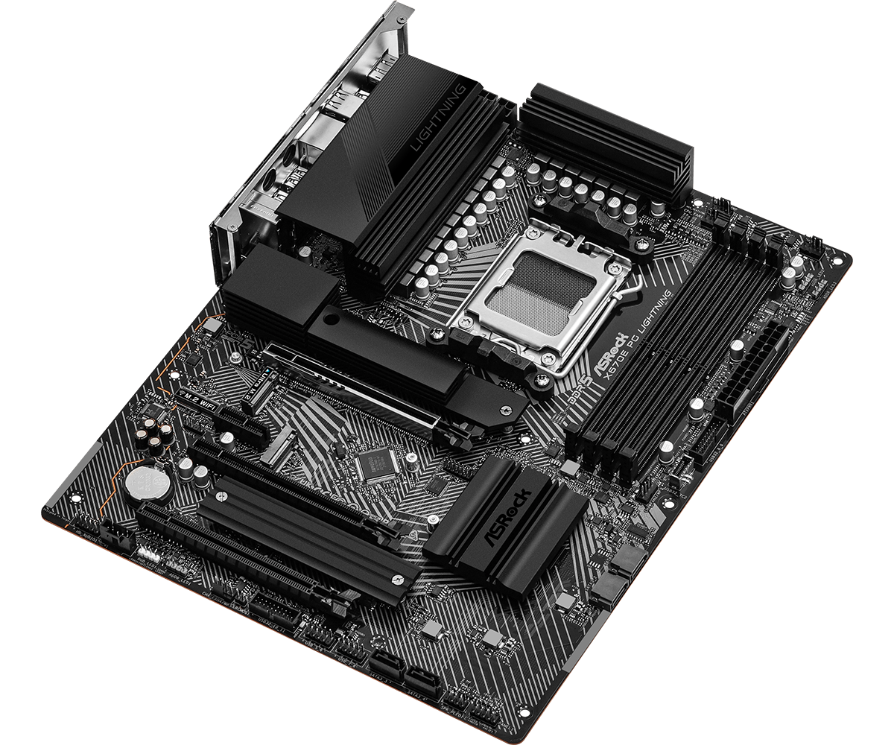

# asrock x670e pg lightning
asrock am5 motherboard using the amd x670e chipset for amd ryzen 7000, 8000 & 9000 series cpus.

## which slot for the hba

### most likely choice: pcie slot 3
the optimal place for your hba if you plan on using pcie slot 1.

#### reasons
- pcie lanes [directly from cpu](#expansion-slot-outtake)
- pcie 4.0 (irrespective of cpu)
- physical x16 slot, 4 data lanes (the 9500-16e can use 8 datalanes however)
- clearance under the slot for airflow
  - [included heatsink](#photo-side-view) for slot m2_4 is low profile

### if you need full sas bandwidth: pcie slot 1
if you don't plan on using it for anything else.

#### reasons
- pcie lanes [directly from cpu](#expansion-slot-outtake)
- pcie 4.0/5.0 [depending on cpu](#cpu-support-vs-pcie-support) (not relevant for the 9500-16e since it's 4.0)
- physical x16 slot, 16, 8 or 4 data lanes [depending on cpu](#cpu-support-vs-pcie-support) (the 9500-16e can use 8 datalanes)
- slots m2_2 and m2_3 aren't that relevant so plenty of room for airflow

## images
### diagram

### bandwidth routing

### cpu support vs pcie support

### expansion slot outtake

### photo: top view

### photo: side view

