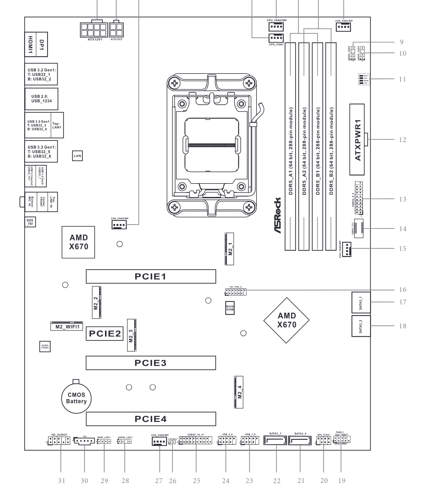

# asrock x670e pg lightning

asrock am5 motherboard, pcie slot 3 is the optimal place for your hba:
* pcie lanes directly from cpu
* x16 slot physical
* clearance under the slot for airflow

## images

