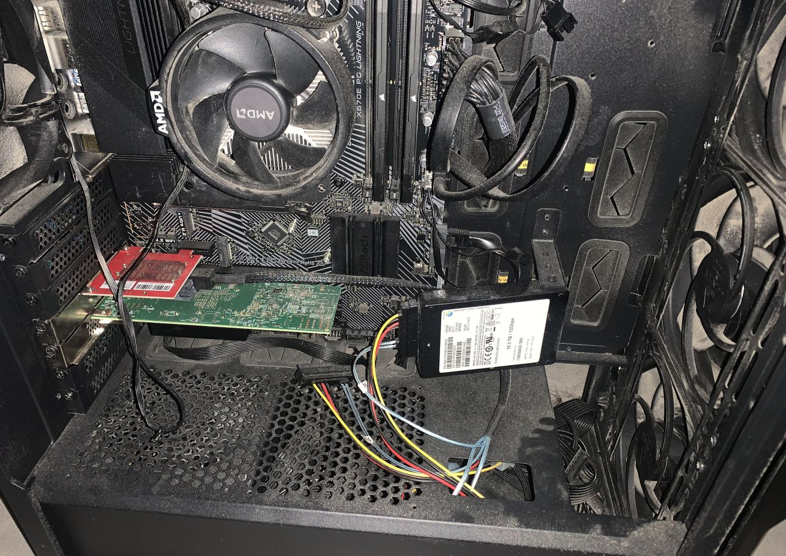

# what am i actually running

workflows have a note of what the initial hardware was when i started, but parts
get swapped in and out ofcourse. so here i'll give an overview of the full setup
i'm running. don't expect this to be updated daily. it will be updated when
noteworthy changes happen. if none happen i'll update it every 3 months or so.

the history of this page (and the rest of the site) is kept on github, last change date is on the bottom of the page.

## battlestation
 - windows 11 pro 25h2 26200.7840
 - amd ryzen 7 9800x3d
 - scythe mugen 6 black edition
 - , uefi 3.50
 - 2 m.2 sn850x black 8tb drives, fw 638211wd
 - asrock challenger radeon rx 9060 xt oc 16gb
 - antec p20ce case (includes 3 120mm fans)
 - 3 arctic p14 pwm pst case fans
 - 

### cleaned it just for this picture


## sas specific - permanent setup

these devices are always installed and powered up

### hba



```
Model = HBA 9500-16e
Firmware Package Build = 37.00.00.00
Firmware Version = 37.00.00.00
Bios Version = 09.73.00.00_37.00.00.00
NVDATA Version = 37.00.00.14
PSOC FW Version = 0x006E
PSOC Part Number = 14790
Driver Name = ItSas35
Driver Version = 2.61.85.00
```

### 
`CLI Version = 007.3603.0000.0000 Oct 30, 2025`


### external to internal sas converter

#### connect with a 0.5m cable

### internal sas drive
```
------------------------------------------------------------------------
EID:Slt DID State DG      Size Intf Med SED PI SeSz Model            Sp
------------------------------------------------------------------------
0:12      1 JBOD  -  13.970 TB SAS  SSD -   -  4 KB X670_S164315TATE -
------------------------------------------------------------------------

Manufacturer Id = NETAPP
Model Number = X670_S164315TATE
NAND Vendor = NA
Firmware Revision = NA56
Raw size = 13.970 TB [0xdf87ffff Sectors]
Coerced size = 13.970 TB [0xdf87ffff Sectors]
Non Coerced size = 13.970 TB [0xdf87ffff Sectors]
Device Speed = 12.0Gb/s
Link Speed = 12.0Gb/s
Negotiated Physical Link Rate = 12.0Gb/s
Sector Size = 4 KB
Config ID = NA
Number of Blocks = 3750232063
Connector Name = C3   x1
```

### 


based on git commit https://github.com/doug-gilbert/sg3_utils/commit/2355dc4b451989291df695148cd8d8d03b3d987e

### 
version
`smartctl pre-8.0-355 2026-01-05 [x86_64-w64-mingw32-w11-25H2] (GHA Build)`

## sas specific - adhoc

these devices get powered on when needed.

### netapp ds224c diskshelf
 - 3 shelves
 - 2 power supplies each
 - 2 iom12a fw0401 each
 - around 50 x371 sas ssd drives

### optical tower
todo
