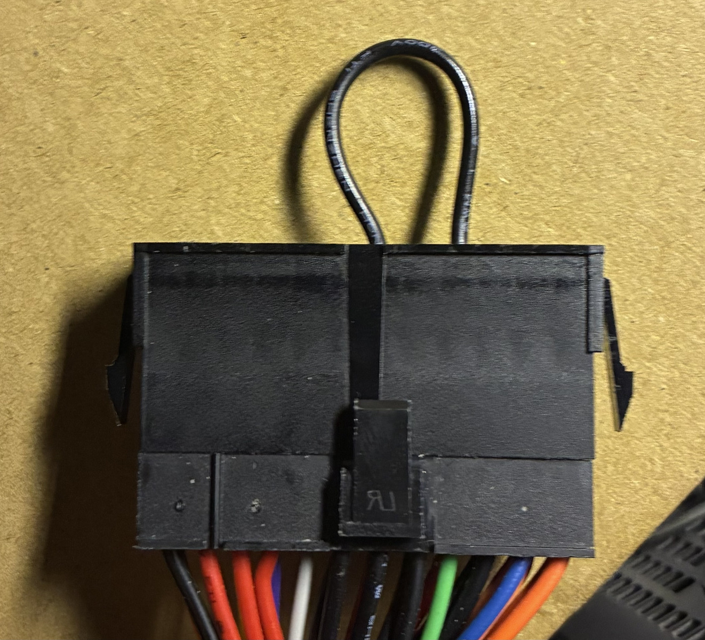
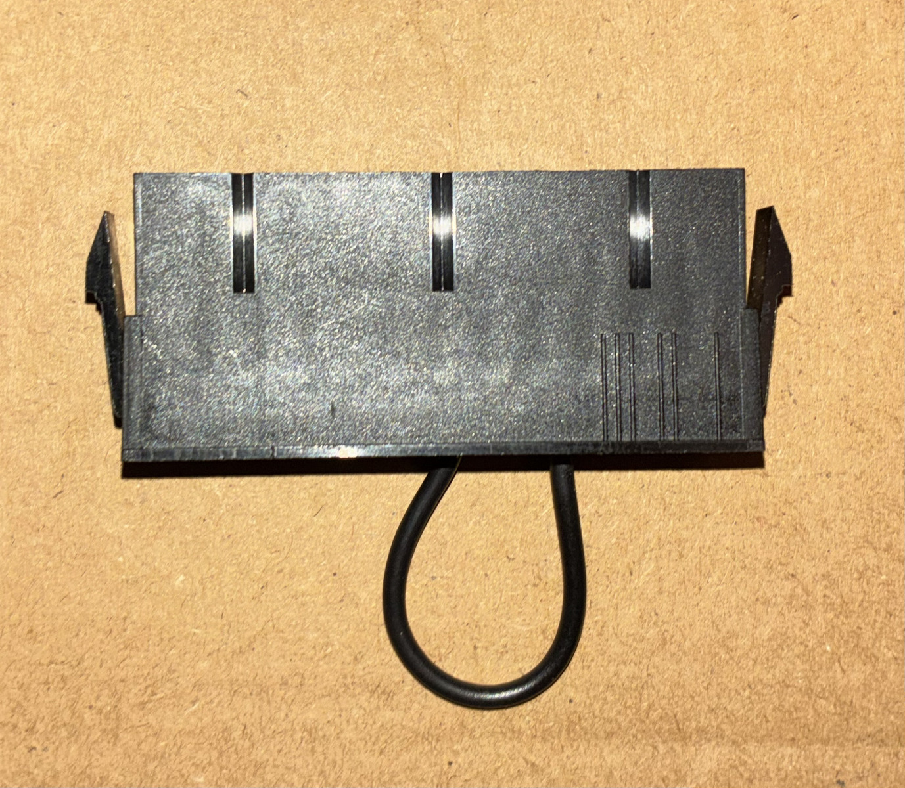
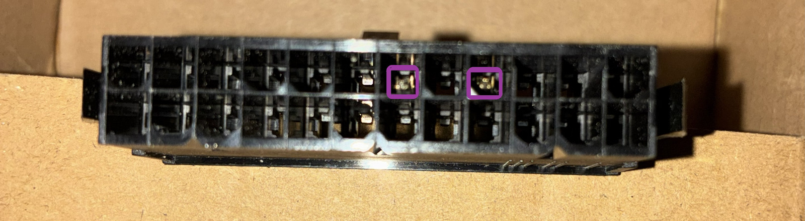
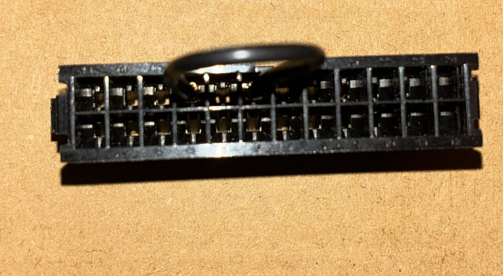
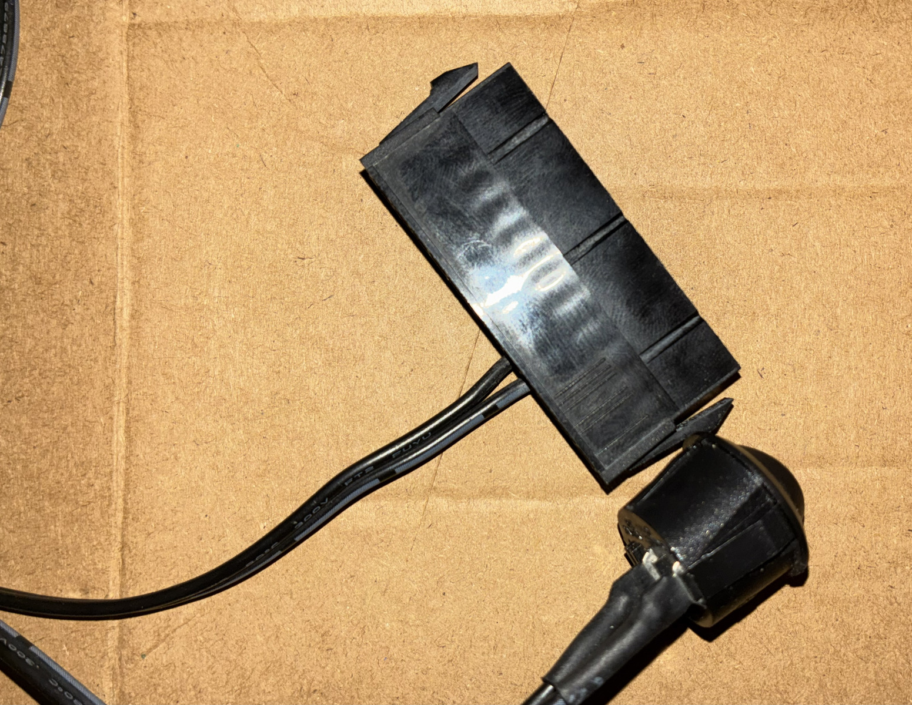
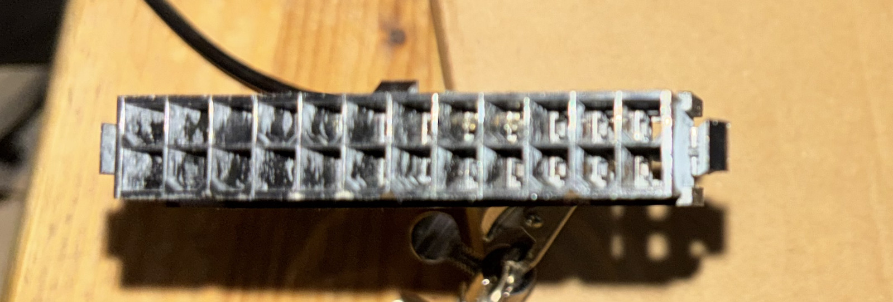
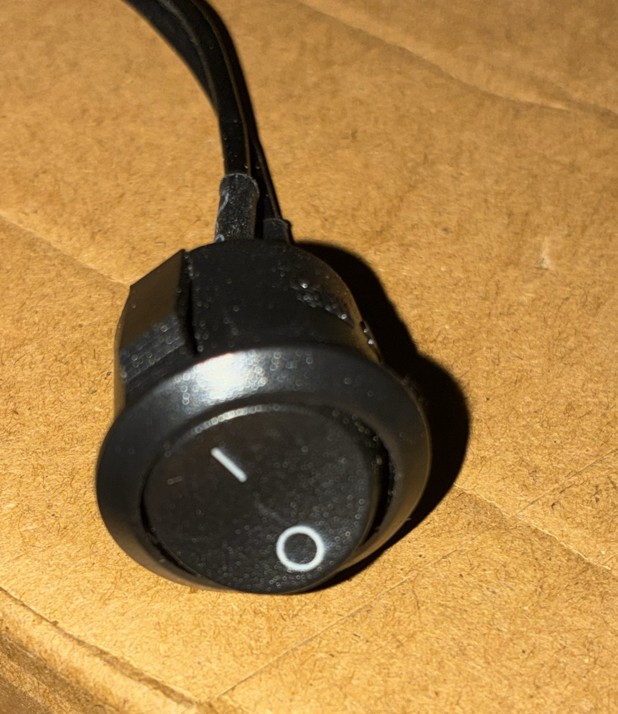
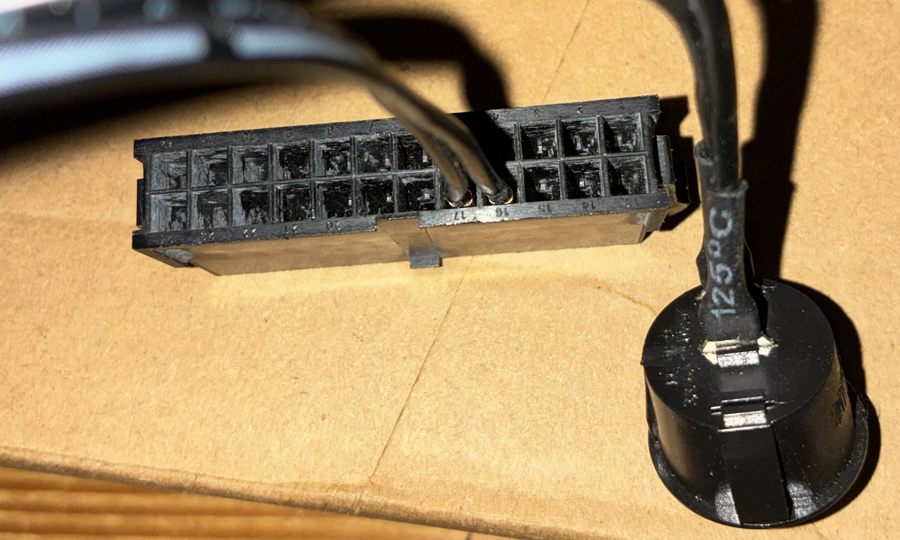

# power on atx psu
a few methods to power on  and


## why
atx power supplies wait for an external signal before they start delivering
power. the intended use is that this will be provided by the motherboard. it
can however be done manually.

> [!IMPORTANT]
> this assumes the usage of a regular atx pc power supply. other power supplies
> should not be expected to behave the same way.

## risks
> [!WARNING]
> the basics to check. further details are beyond the scope of this guide.

* older power supplies expect a minimum load on certain voltage rails. when using such
a psu make sure to always provide this base load.
* verify the supported load per cable & connector, factor in power spikes like
multiple drives spinning up at the same time.

## how
make contact between ps_on (green wire) and ground (black wire) to signal the
psu to power on. this contact needs to remain in place, if not the psu will
power down.

### option 1: paperclip
a commonly used option is to use a paperclip to short ps_on to ground. while
it does the job just fine there are a few things to take into account:
 * can be fiddly to get it inserted, thin paperclips can fall out
 * extended use can cause the contacts in the atx plug to wear out
 * in general not advised to use unattended

### option 2: atx plug with permanent connection
does what the paperclip does but safer and more durable.

looks like this, pins tend to be very thin, perhaps to thin.

### option 3: atx plug wired with switch

seems like an elegant solution but it makes terrible contact so
half of the time the psu won't power on.

### todo option 4: power converter board
