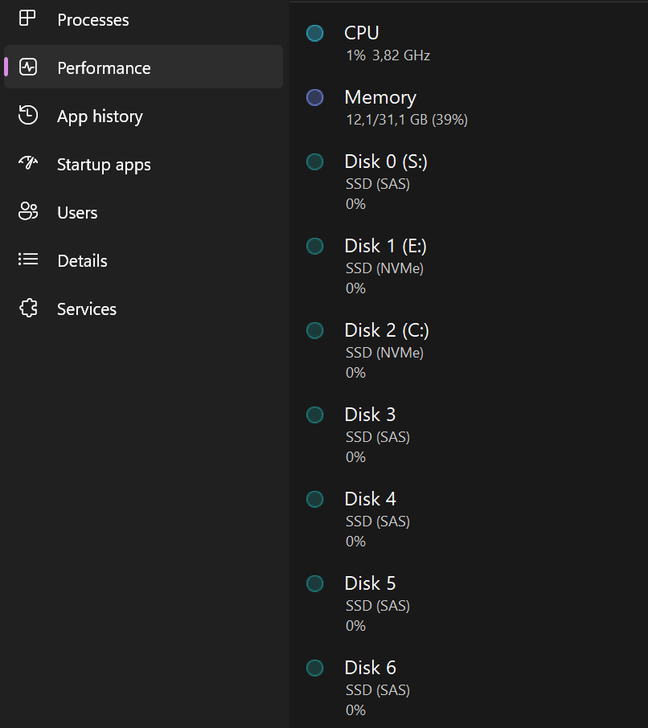

# using sg_scan.exe

# todo words

## todo optical drives

## simple scan
the basic form. will show physical drive number and assigned drive letter.

```
sg_scan.exe
PD0     [S]     NETAPP    X670_S164315TATE  NA55  S40TNY0M105275
PD1     [E]     WD_BLACK SN850X 8000GB  638211WD  E823_8FA6_BF53_0001_001B_448B_4071_28F4.
PD2     [C]     WD_BLACK SN850X 8000GB  638211WD  E823_8FA6_BF53_0001_001B_448B_4071_2C80.
```

## scan with bus and adapter
this will also include the bus type (sas and nvme in this example),
as well as include adapter and expander info

> [!TIP] 
> the `-s` option is a bit more important on windows, this is where you'll get the mapping for
> most situations where a device is asked in sg3 tools.

unclaimed devices are also shown here.

```
sg_scan.exe -bs
PD0     [S]     <Sas  >  NETAPP    X670_S164315TATE  NA55  S40TNY0M105275
PD1     [E]     <NVMe >  WD_BLACK SN850X 8000GB  638211WD  E823_8FA6_BF53_0001_001B_448B_4071_28F4.
PD2     [C]     <NVMe >  WD_BLACK SN850X 8000GB  638211WD  E823_8FA6_BF53_0001_001B_448B_4071_2C80.

SCSI2:0,12,0   claimed=1 pdt=0h          NETAPP    X670_S164315TATE  NA55
SCSI2:0,16,0   claimed=0 pdt=dh          BROADCOM  VirtualSES  03
SCSI3:0,0,0    claimed=1 pdt=0h          NVMe      WD_BLACK SN850X   11WD
SCSI4:0,0,0    claimed=1 pdt=0h          NVMe      WD_BLACK SN850X   11WD
```

## find drive
```
>sg_scan.exe -b
PD0     [S]     <Sas  >  NETAPP    X670_S164315TATE  NA55  S40TNY0M105275
PD1     [E]     <NVMe >  WD_BLACK SN850X 8000GB  638201WD  E823_8FA6_BF53_0001_001B_448B_4071_28F4.
PD2     [C]     <NVMe >  WD_BLACK SN850X 8000GB  638201WD  E823_8FA6_BF53_0001_001B_448B_4071_2C80.
PD3             <Sas  >  NETAPP    X371_S164A960ATE  NA54  S5JENE0R603645
PD4             <Sas  >  NETAPP    X371_S164A960ATE  NA54  S5JENE0R502225
PD5             <Sas  >  NETAPP    X371_S164A960ATE  NA54  S5JENE0R502235
PD6             <Sas  >  NETAPP    X371_S164A960ATE  NA54  S5JENE0R502224
PD7             <Sas  >  NETAPP    X371_S164A960ATE  NA54  S5JENE0R502223
PD8             <Sas  >  NETAPP    X371_S164A960ATE  NA54  S5JENE0R502221
PD9             <Sas  >  NETAPP    X371_S164A960ATE  NA54  S5JENE0R502238
PD10            <Sas  >  NETAPP    X371_S164A960ATE  NA54  S5JENE0R607104
```

## alternative: windows task manager
a strange but simple alternative which is also seems to be a lot more responsive than sg_scan.exe is the humble windows task manager in the performance overview. it does not matter if the disk have a drive letter assigned nor what sector size they have. they will show up there.

> [!NOTICE]
> the times i've compared task manager and sg_scan.exe the PD mappings
> always matched the disk number in task manager. i cannot guarantee this
> will always be the case, so use caution.


