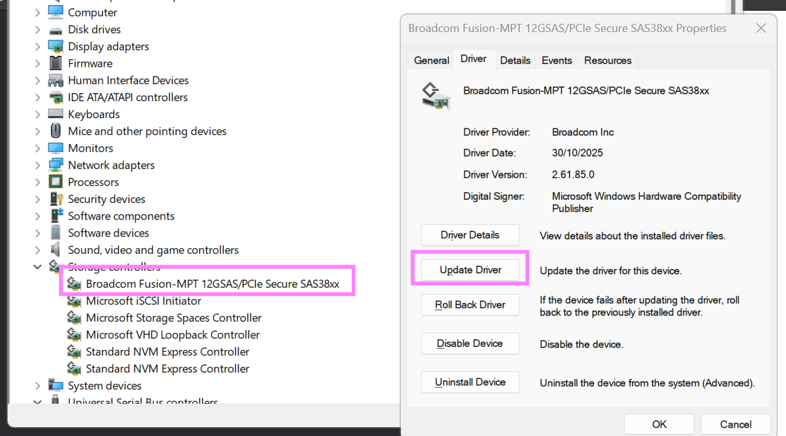
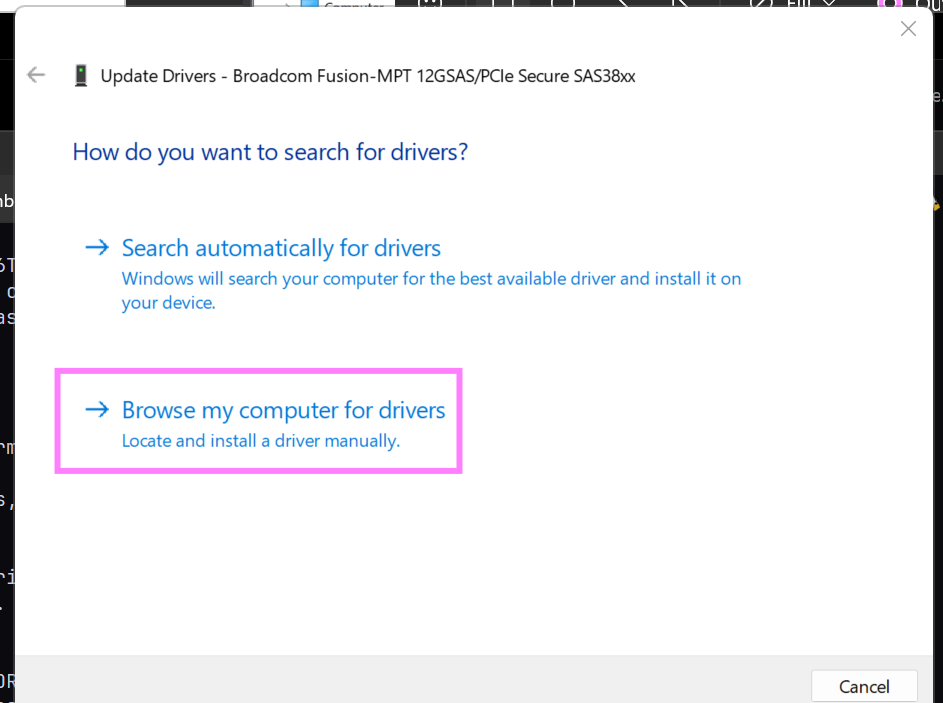

# todo
when a newer firmware gets released for broadcom devices.

storcli, drivers, firmware & psoc can all be downloaded from the broadcom
support site.

your storcli, driver & firmware's revision code (pxx number) should match - p37
in this example. the psoc version can & will differ.

example:
 - storcli: `STORCLI_SAS3.5_P37.zip`
 - driver: `ItSas35_Windows11_Windows_Server_2022_2025_P37.zip`
 - firmware: `9500_16e_Pkg_P37_MIXED_FW_BIOS_UEFI.zip`
 - psoc: `1.32_PSoC_Catalog_Firmware_HBA.zip`

{}
1. ## upgrade storcli to newest version
   just download the newest storcli for your hba. for the 9500 series
   this will be `storcli sas3.5`. unzip & start using the new `storcli64.exe`.

2. ## upgrade hba driver to newest version and reboot
   also not rocket science. open the driver zip file, extract the folder for
   your operating system, `Win11_25H2_x64` in this case. open device manager,
   go to the hba & click `update driver`. use the option `browse my computer
   for drivers` and select the folder you just unzipped.
   
   

3. ## upgrade hba firmware

4. ## upgrade psoc if available

{}
